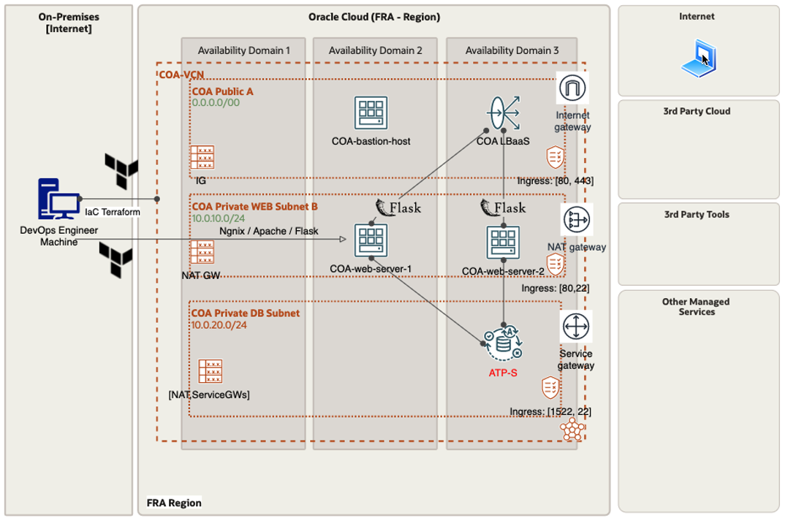
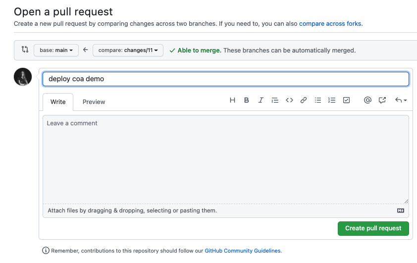
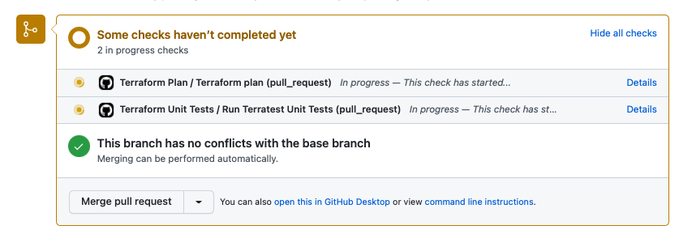
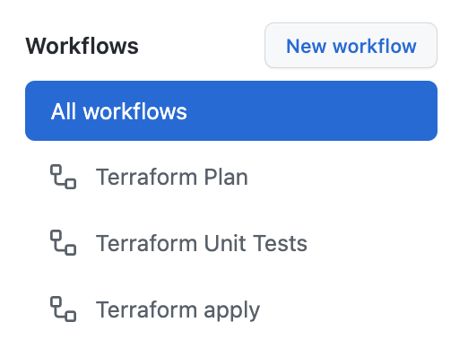
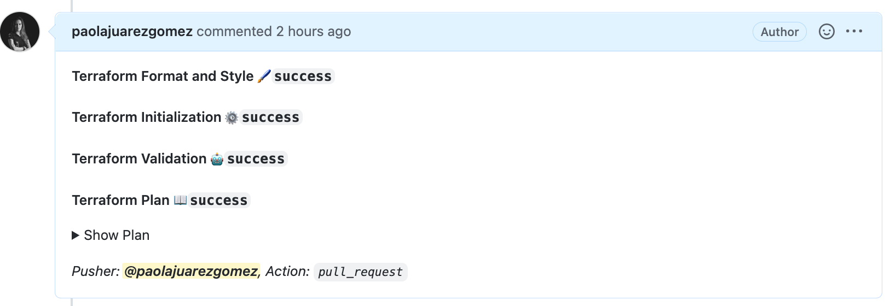
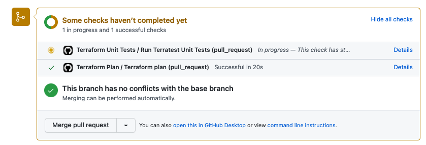

# COA Deploy TRF with GitHub UseCase. 
# -- How to build a pipeline with GitHub Action  --

## ✅ Showcase

GitHub Actions is a continuous integration and continuous delivery (CI/CD) platform that allows you to automate your build, test, and deployment pipeline. You can create workflows that build and test every pull request to your repository, or deploy merged pull requests to production.

During this UseCase we're going to:

* Use Github Actions to build different pipelines.
* Create a test pipeline.
* Deploy IaC using Terraform

## ✅ Usage

The first thing you’ll need to do before your GitHub Actions can run is to add your credentials to the repository. To do this you will need to follow these steps:

* Navigate to your repository and select the Settings tab.
* Once there you should see on the left a Secrets section third from the bottom of the list, click on that.
* Click on the New repository secret button.
* Add the next secrets:

````
user_id
api_fingerprint
token
````
* *token* is a personal [github token](https://docs.github.com/en/authentication/keeping-your-account-and-data-secure/creating-a-personal-access-token).

* Clone this repo in GitHub and create you own repository.
* The pipelines configuration is defined in .github/workflows, in this case we have created plan.yaml, unit.yaml and apply.yaml
* Add your *api_private_key* to the file **user.pem**
* Rename the file **terraform.tfvars.template** to **terraform.tfvars** and add the values of your *tenancy_ocid* and *compartment_ocid*
* Define the values desired in the  **coa_demo.auto.tfvars**

* The terraform code included in this demo will deploy the next resources:


* Create a new branch, change the repo files and publish the changes to the new branch. 
* Open a "merge pull request" and check how the first two pipelines run:




* This action will start the pipeline test and plan:


* If we review the 3 different pipelines in the tab "actions":



* When the plan pipeline ends you can se the actions/github-script@v6  outcome, this allow you to review the plan outcome before approve the merge.




* This is the outcome of actions/github-script@v6 for the test pipeline.


* When you approve the merge, the apply pipeline will be automatically launched.


* Check that now you can see the database provisioned in your compartment.


* After the provisioning, the outcome of the apply step is showed in the merge request page.


* Remove manually (using OCI Console) all the resources created in this demo.

If you need help, ask us in the slack channel #iac-enablement

## ✅ References
* [https://acloudguru.com/blog/engineering/how-to-use-github-actions-to-automate-terraform](https://acloudguru.com/blog/engineering/how-to-use-github-actions-to-automate-terraform)
